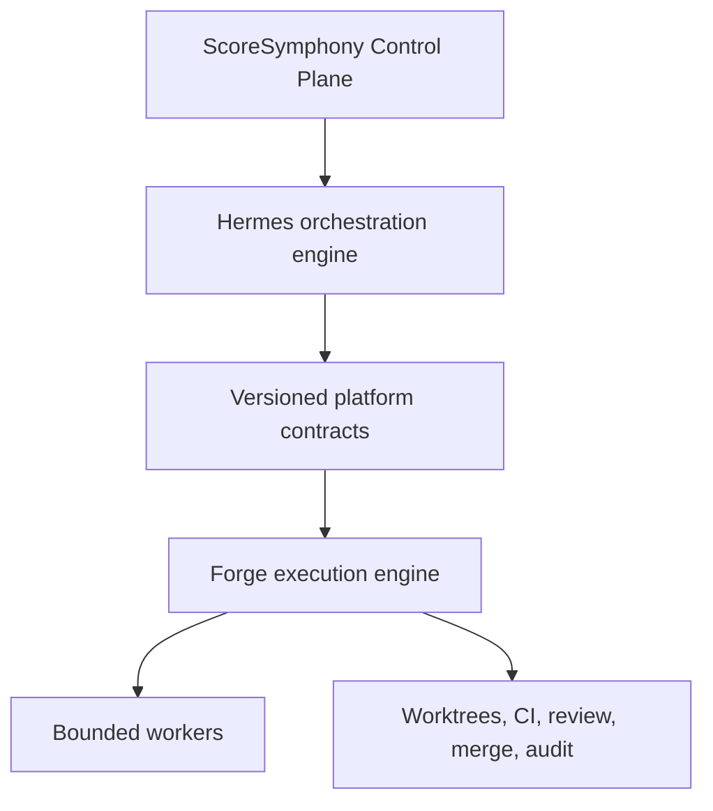

# ScoreSymphony Agent Platform architecture

Status: baseline decision, version 1

## System boundary

`AI-Agent-VPS` contains the complete source-controlled Agent Platform. It does
not contain model weights, secrets, mutable runtime data, or automatically
downloaded external applications.

## Decision authority

| Decision | Owner |
|---|---|
| Interpret the user's goal | Hermes |
| Decompose work into tasks | Hermes |
| Select agent/model/tool class | Hermes |
| Decide whether research or rework is needed | Hermes |
| Validate task-state transitions | Forge |
| Create and protect worktrees | Forge |
| Start, observe, retry, or cancel runs when instructed | Forge |
| Enforce CI, review, and merge gates | Forge |
| Perform the bounded task | Worker |
| Present and audit system state | ScoreSymphony Control Plane |

Forge may make deterministic lifecycle decisions. It must not independently
perform strategic task decomposition or select a different agent plan.

## Integration boundary

Hermes must not import Forge internals. The integration layer exposes versioned
commands and events under `platform/contracts/v1`.

Initial commands include:

- `create_task`
- `update_task`
- `start_worker`
- `create_worktree`
- `inspect_worktree`
- `run_tests`
- `request_review`
- `retry_run`
- `cancel_run`
- `merge_task`
- `get_events`
- `get_resources`

The transport may initially be local HTTP or MCP. Transport selection does not
change command semantics.

## State ownership

- Forge owns task execution state, run state, worktree leases, CI results,
  reviews, merge authorization, and immutable execution events.
- Hermes owns planning context, reasoning state, delegation intent, skills, and
  orchestration memory.
- The Control Plane owns presentation preferences and operator-facing views.
- Component metadata is declarative and canonical in `COMPONENTS.yaml`.

State must not be duplicated without an explicit synchronization contract.

## Component classes

| Class | Bundled | License rule | Integration |
|---|---:|---|---|
| `core` | yes | MIT | internal, behind contracts |
| `vendored` | yes | MIT | internal, provenance required |
| `managed_external` | no | original license | installed on demand, process boundary |
| `remote_external` | no | provider terms | API/MCP boundary |

## Deployment boundary

KVM 4 and KVM 8 roles are deliberately not fixed in this baseline. The first
vertical slice must run on one host. Multi-VPS placement is a later deployment
decision based on measured resource use, failure domains, and security needs.

The separate ScoreSymphony music application is not silently merged into this
repository by this decision. This repository owns the Agent Platform and its
control surface.

## First acceptance criterion

The baseline becomes an integrated platform only when an automated end-to-end
test proves this sequence:

1. A user goal reaches Hermes.
2. Hermes emits a valid `create_task` command.
3. Forge creates a task and isolated worktree.
4. A shell worker makes a fixture change.
5. Forge records test and review results.
6. Forge permits a merge only after required gates pass.
7. Hermes receives the terminal result through a platform event.
