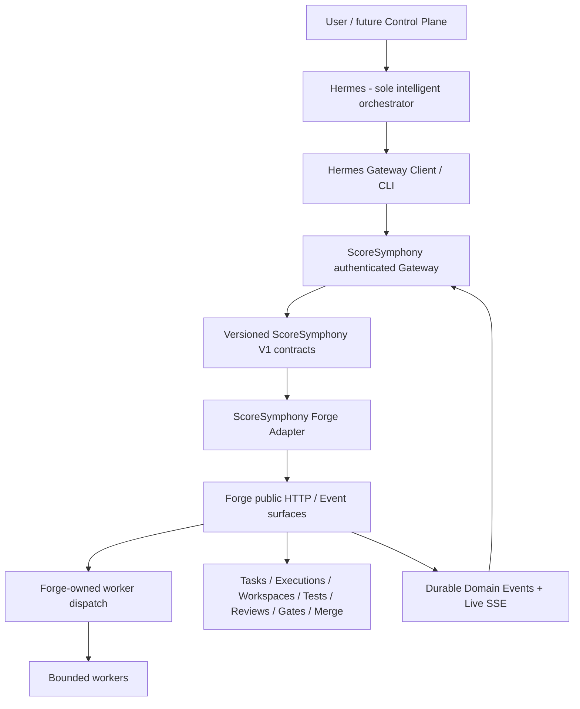

# ScoreSymphony Agent Platform Architecture

Status: **current baseline architecture**  
Updated: **2026-09-02**

## 1. System boundary

`AI-Agent-VPS` contains the source-controlled ScoreSymphony Agent Platform. It
contains the pinned Forge and Hermes upstream snapshots plus ScoreSymphony-owned
contracts, adapters, gateway/runtime code, workers, security contracts, tests
and deployment assets.

It does **not** contain model weights, production secrets, mutable runtime data,
backups or automatically downloaded external applications.



The diagram includes the **target worker-dispatch and live-event path**. The
HTTP command path and historical event recovery are implemented. Canonical live
SSE projection/reconnect and Forge-backed shell-worker dispatch are still open.

## 2. Authority model

There must be exactly one owner for each lifecycle responsibility.

| Responsibility | Canonical owner |
|---|---|
| Interpret user goal and plan work | Hermes |
| Decompose work into tasks | Hermes |
| Select required capability/agent class | Hermes |
| Decide strategic rework/research | Hermes |
| Validate and own task lifecycle | Forge |
| Own task versions / optimistic concurrency | Forge |
| Create and own executions | Forge |
| Create and isolate workspaces | Forge |
| Dispatch workers | Forge |
| Store tests and execution evidence | Forge |
| Own review/gate lifecycle | Forge |
| Authorize lifecycle merge transition | Forge |
| Execute a bounded assignment | Worker |
| Translate between Hermes/V1/Forge public interfaces | ScoreSymphony Integration Layer |
| Authenticate/authorize ScoreSymphony ingress and protected operations | ScoreSymphony security layer + Forge public security boundary |
| Present canonical runtime state | future ScoreSymphony Control Plane |

Hermes may decide **what should be done**. Forge decides deterministically
whether and how the requested lifecycle transition is valid. Workers perform the
bounded execution. None of these layers may silently create a second copy of
Forge lifecycle truth.

## 3. V1 integration contract

Hermes must not import Forge database models or private Forge services. The
ScoreSymphony integration layer exposes versioned commands, receipts, reads and
events.

### 3.1 Current V1 commands

The supported command vocabulary is:

- `create_task`
- `update_task`
- `start_task`
- `submit_task`
- `request_changes_task`
- `approve_task`
- `cancel_task`
- `retry_execution`
- `cancel_execution`

The following older design commands are **not part of the current contract**:
`start_worker`, `create_worktree`, `inspect_worktree`, `run_tests`,
`request_review`, `merge_task`, `retry_run` and `cancel_run`. Those operations
would duplicate or bypass Forge-owned lifecycle behavior.

### 3.2 Canonical identifiers

Current contracts and adapters use Forge-aligned identifiers, including:

- `project_id`
- `task_id`
- `execution_id`
- `workspace_id`
- `review_id`
- `command_id`
- `correlation_id`
- `causation_id`

`run_id` is obsolete in the ScoreSymphony V1 contract.

### 3.3 Submission versus terminal truth

A `CommandReceipt` is a submission result. It may indicate accepted, duplicate
or pre-dispatch rejected submission state, but it is **not proof that the
requested lifecycle operation ultimately succeeded**.

Terminal truth is delivered by versioned events such as:

- `command.succeeded`
- `command.rejected`
- `command.failed`

Terminal command events require command causation so that the result can be
traced back to the command that caused it.

## 4. Current transport and event architecture

### Implemented

- ScoreSymphony uses HTTP/JSON for the command/read integration path.
- The ScoreSymphony gateway authenticates Hermes-side requests.
- The Forge transport authenticates gateway-to-Forge requests.
- Commands are validated before dispatch and mapped only to public Forge
  operations.
- Forge exposes authenticated historical persisted domain events through
  `/api/v1/events` when historical query parameters are supplied.
- Historical reads use an exclusive sequence cursor, bounded page size and
  strictly ordered public DTOs.
- The ScoreSymphony recovery adapter validates cursor/order behavior and can
  skip unsupported internal Forge events while still advancing the recovery
  cursor correctly.
- Forge's parameterless `/api/v1/events` remains the existing live broadcast
  SSE surface.

### Not yet complete

- ScoreSymphony canonical V1 projection of the **live** Forge SSE stream.
- Race-safe transition from historical catch-up to live consumption.
- Reconnect and `events.resync_required` recovery through historical reads.
- Persistent consumer cursor policy after successful processing.

These are the immediate transport tasks for the Integrated Kernel release gate.

## 5. Forge adapter boundary

The ScoreSymphony Forge adapter is allowed to:

- map V1 commands to verified public Forge HTTP operations;
- carry `project_id`, task versions and Forge identifiers correctly;
- normalize Forge lifecycle events into V1 events;
- convert optimistic-concurrency or public Forge failures into deterministic
  ScoreSymphony rejections/failures;
- read persisted events through the public historical-event API.

It is not allowed to:

- import Forge database internals into Hermes;
- write directly to Forge persistence;
- create a second task/execution/workspace/review/merge database;
- bypass Forge review, gate or merge authority;
- dispatch workers directly from Hermes or the gateway outside Forge lifecycle.

## 6. Worker architecture

The deterministic shell-worker reference implementation is an accepted bounded
execution primitive. It provides executable allowlisting, workspace
confinement, deterministic environment/result handling, timeout, cooperative
cancellation, caller-controlled retry attempts, declared write paths and
changed-path evidence.

It is **not** an orchestrator and it is not yet the complete integrated worker
path. The next required architecture step is:

```text
Hermes intent
  -> ScoreSymphony Gateway
  -> Forge task/execution lifecycle
  -> Forge-owned worker dispatch
  -> bounded Shell Worker
  -> Forge evidence/test/review/gate state
  -> Forge events
  -> ScoreSymphony V1 event
  -> Hermes context
```

No direct `Hermes -> ShellWorker` or `Gateway -> ShellWorker` production path is
permitted.

## 7. Security architecture

### Security foundation already present

Shared security contracts define:

- principals and credentials;
- resource scopes;
- authorization requests/decisions;
- policies;
- approval requests/records;
- exact operation binding/digests;
- expiry and consumed approval state.

The reference evaluation is default-deny with precedence:

```text
DENY > REQUIRE_APPROVAL > ALLOW
```

The V1 `actor` field is asserted command data only. It must be bound to an
authenticated principal at runtime and must never be trusted as authentication
evidence by itself.

### Production security still required

- ingress principal binding;
- production credential provisioning and rotation;
- persistent RBAC/policy configuration;
- persistent role bindings;
- persistent approvals with atomic consumption;
- authorization re-evaluation before protected dispatch;
- secret-safe persistent audit events;
- tested denial of forbidden paths, commands, egress and privilege expansion;
- Forge authentication bootstrap and production secret injection.

Until these are complete, the platform must not be described as production
security-ready or exposed as a production service.

## 8. State ownership and recovery

- Forge owns durable task/execution/workspace/review/gate/merge state and domain
  events.
- Hermes owns planning context, reasoning/orchestration context and intent.
- ScoreSymphony adapters may hold transient transport state but must not become a
  competing lifecycle authority.
- A future Control Plane reads canonical runtime state rather than maintaining a
  second workflow database.

Historical event recovery exists. Full runtime recovery still requires durable
command idempotency, replay-safe correlation, restart/orphan handling and
well-defined consumer cursor persistence.

Ambiguous command submissions must **not** be blindly retried until a
Forge-owned deduplication/recovery strategy is implemented and proven.

## 9. Component classes

| Class | Bundled | License rule | Integration |
|---|---:|---|---|
| `core` | yes | repository-compatible | internal, behind contracts |
| `vendored` | yes | compatible + provenance required | pinned snapshot |
| `managed_external` | no | original license | installed/managed behind process boundary |
| `remote_external` | no | provider terms | API/MCP/CLI boundary |

`UPSTREAMS.yaml` and `THIRD_PARTY_NOTICES.md` are authoritative for the current
Forge/Hermes snapshot provenance. Those files and nested upstream license
notices must survive any fresh Git repository initialization.

## 10. Deployment architecture

Single-node remains the reproducible reference topology. KVM 4, KVM 8, remote
workers, monitoring/backup hosts or GPU nodes are optional placement choices
made later from measurements and failure-domain requirements.

Current deployment foundation includes Compose/deployment validation, health
basics and a non-root gateway image. Production gateway Compose wiring is
intentionally deferred until Forge authentication bootstrap and secret
injection are defined.

The separate ScoreSymphony music application remains a distinct fachliche
application and should connect through versioned APIs/jobs rather than direct
cross-database coupling.

## 11. Integrated Kernel acceptance gate

The first complete platform kernel is accepted only when automation proves all
of the following together:

1. Hermes creates a valid V1 task intent.
2. ScoreSymphony validates and submits it through the authenticated gateway.
3. Forge creates the project-bound task and owns the lifecycle.
4. Forge starts an execution and isolated workspace.
5. Forge dispatches the bounded shell worker.
6. The worker changes only an allowed fixture path and returns evidence.
7. Forge stores evidence/tests and enforces review/gates.
8. Failed review/gates prevent completion/merge.
9. A successful lifecycle reaches a controlled terminal state.
10. Terminal results reach Hermes as validated V1 events.
11. Duplicate delivery does not create a second lifecycle.
12. Stale task versions are deterministically rejected.
13. A broken live-event connection recovers through historical events and
    resumes live consumption without silent gaps or duplicate lifecycle state.

Historical recovery and shell-worker acceptance are already available building
blocks. The remaining kernel blockers are live-event integration, Forge-owned
worker dispatch, durable idempotency and the complete process-level E2E proof.