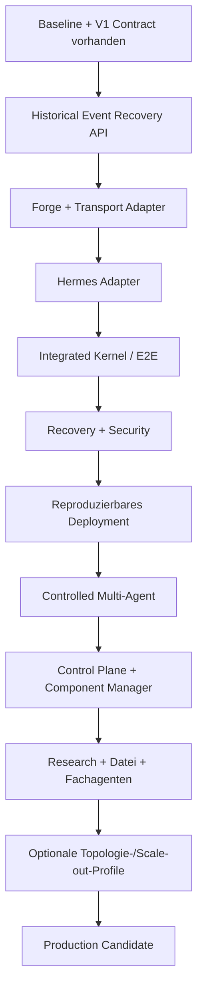

# ScoreSymphony Agent Platform – Roadmap

Status: 2026-09-02  
Repository: `ScoreSymphony/AI-Agent-VPS`  
Aktueller Hauptstand: PR #4 (`Align V1 integration contract with Forge lifecycle`) ist nach `main` gemergt.

## Zweck

Diese Roadmap beschreibt den Weg vom aktuellen, bereits lizenzgeprüften und
versionierten Monorepo-Kern zu einer produktionsfähigen ScoreSymphony Agent
Platform. Sie verwendet bewusst kein historisches Phasenmodell. Reihenfolge,
Parallelisierung und Priorität ergeben sich aus technischen Abhängigkeiten,
Risiken und überprüfbaren Release-Gates.

Die Roadmap ist **deployment-neutral**. Sie setzt weder eine bestimmte Anzahl
von VPS noch bestimmte Hostnamen, Anbieter oder Hardware voraus. Eine lokale
Entwicklungsmaschine, ein einzelner Server, mehrere Server, Remote-Worker oder
spätere GPU-Knoten sind Deployment-Varianten derselben Plattform und keine
unterschiedlichen Architekturen.

## Verbindliches Zielbild

- **Hermes ist der einzige intelligente Orchestrator.**
- **Forge ist die deterministische Task-, Execution-, Workspace-, Review-,
  Gate- und Merge-Authority.**
- Worker führen begrenzte Aufgaben aus und bauen keine konkurrierende
  Orchestrierung oder zweite Lifecycle-Wahrheit auf.
- Die ScoreSymphony-Integrationsschicht verbindet Hermes und Forge nur über
  versionierte, ScoreSymphony-eigene Verträge und öffentliche Forge-Oberflächen.
- Die Control Plane zeigt Zustand, Ereignisse, Freigaben, Ressourcen,
  Komponenten und Workflows, besitzt aber keine zweite Orchestrierungslogik.
- Der von ScoreSymphony gepflegte Kern bleibt lizenzsauber. Nicht kompatible
  externe Komponenten werden getrennt installiert und über dokumentierte
  Prozessgrenzen wie CLI, MCP oder HTTP angebunden.
- Modellgewichte, Geheimnisse, Laufzeitdaten, Backups und automatisch
  installierte externe Anwendungen gehören nicht in das Git-Repository.
- Die Kernplattform darf nicht von einem bestimmten Modellanbieter oder einer
  kostenpflichtigen API abhängen. Modelle und Coding-Systeme werden über
  Adapter austauschbar gehalten.
- Deployment-Topologie ist konfigurierbar: Single-Node ist die reproduzierbare
  Referenzbasis; Multi-Node und spezialisierte Worker-Knoten sind optionale
  Erweiterungen nach Messung und Bedarf.

## Architekturgrenzen

### Hermes

Hermes plant, priorisiert, zerlegt Aufgaben und entscheidet fachlich, welcher
Agent beziehungsweise welche Fähigkeit benötigt wird. Hermes besitzt jedoch
keinen konkurrierenden Forge-Lifecycle-State.

### Forge

Forge bleibt kanonische Authority für:

- Projekte und Tasks,
- Task-Versionen und Lifecycle-Übergänge,
- Executions,
- Workspace-/Worktree-Erzeugung,
- Worker-/Agent-Dispatch,
- Tests und Belege,
- Reviews und Gates,
- Merge-Entscheidungen,
- persistente Domain Events und Lifecycle-Audit.

### ScoreSymphony Integration Layer

Die Integrationsschicht:

- validiert V1-Nachrichten,
- übersetzt Hermes-Intents in öffentliche Forge-Operationen,
- normalisiert Forge-Ereignisse in stabile V1-Events,
- übernimmt Transport, Recovery und Adapterlogik,
- führt aber keinen zweiten Task-, Execution-, Review- oder Merge-State.

### Worker

Worker erhalten begrenzte Aufträge, Tools, Workspaces, Ressourcenbudgets und
Policies. Sie dürfen Lifecycle-Gates nicht umgehen.

### Control Plane

Die Control Plane ist Operator- und Beobachtungsoberfläche. Sie liest den
kanonischen Runtime-State und führt autorisierte Aktionen über dieselben
Verträge aus wie andere Clients.

## Aktueller Stand

### Erledigt

- Zentrales Monorepo festgelegt und Baseline nach `main` gemergt.
- Forge und Hermes als gepinnte Upstream-Snapshots integriert.
- Nicht kompatible Hermes-Unterpfade aus dem übernommenen Kern ausgeschlossen
  und dokumentiert.
- Rollen von Hermes, Forge, Workern, Integration Layer und Control Plane
  dokumentiert.
- V1 Command- und Event-Schemas sowie ausführbare Python-Modelle implementiert.
- Zentrale Validierung mit strukturierten Rejections implementiert.
- V1-Daten nach erfolgreicher Validierung rekursiv read-only gemacht.
- Command-Submission und terminale Ausführungsergebnisse getrennt:
  `CommandReceipt` beschreibt nur Ingress; terminale Wahrheit kommt über
  persistente `command.*`-Events.
- Command-Plane und Read/Event-Plane getrennt.
- `causation_id` für terminale Command-Events eingeführt.
- ADR-0001 für lokalen HTTP/JSON-Transport mit Live-SSE-Rückkanal akzeptiert.
- ADR-0002 akzeptiert und V1 an den verifizierten Forge-Lifecycle angepasst.
- `create_task` ist explizit projektgebunden (`project_id`).
- Task-Mutationen tragen erwartete Forge-Versionen für optimistic concurrency.
- `run_id` wurde vor dem Contract-Freeze durch Forge-konformes `execution_id`
  ersetzt.
- V1-Command-Vokabular auf Forge-konforme Lifecycle-Aktionen reduziert:
  `create_task`, `update_task`, `start_task`, `submit_task`,
  `request_changes_task`, `approve_task`, `cancel_task`, `retry_execution`,
  `cancel_execution`.
- Direkte konkurrierende Commands für Worktree-Erzeugung, Tests, Review,
  Worker-Dispatch und Merge aus V1 entfernt; diese bleiben Forge-Effekte.
- Forge-Live-SSE technisch geprüft: `/api/v1/events` ist Broadcast-SSE und
  signalisiert bei Lag `events.resync_required`, bietet aber selbst keinen
  historischen Replay.
- Forge besitzt intern geordnete persistente Domain Events und Cursor-basierte
  Reads.
- Contract-Fixtures, Kompatibilitäts-, Semantik-, Negativ- und Timestamp-Tests
  ergänzt.
- PR #4 vollständig über CI geprüft; letzter dokumentierter Lauf: 83 Tests grün.
- Component Registry mit einer deaktivierten `managed_external`-Pilotkomponente
  angelegt.
- Baseline-Validierung, Packaging-Checks, Pytest und GitHub Actions vorhanden.
- Read-only-Upstream-Prüfer für Forge und Hermes vorhanden.

### Aktueller Blocker

Für produktionsfähige Event-Recovery fehlt eine kleine öffentliche,
authentifizierte und read-only Forge-API zum historischen Lesen persistenter
Domain Events nach einem Sequence-Cursor.

### Noch nicht umgesetzt

- Öffentlicher historischer Forge-Domain-Event-Read.
- Laufender ScoreSymphony Command-HTTP-Endpunkt und V1-SSE-Projektion.
- Forge-Adapter gegen ausschließlich öffentliche Forge-Oberflächen.
- Hermes-seitige V1-Tools und Event-Integration.
- Durable Command-Idempotenz über Forge-eigenen State beziehungsweise Events.
- Deterministischer Shell-Worker-End-to-End-Slice.
- Vollständige Recovery-, Auth-, Policy- und Approval-Schicht.
- Reproduzierbares produktionsnahes Deployment.
- Observability und Runbooks.
- Agent Registry, Resource Scheduler und unabhängiger Review-Pfad.
- Modell-/Coding-Adapter.
- ScoreSymphony Control Plane.
- Sicherer Component Manager.
- Research-, Datei-, Infrastruktur- und Fachagenten.
- ScoreSymphony-Fachanbindung.
- Optionale Multi-Node-/Remote-Worker-Topologien und deren Ausfalltests.

## Abhängigkeitskette



Spätere Pakete dürfen parallel vorbereitet werden, sobald ihre
Eingangsvoraussetzungen erfüllt sind. Kein späteres Paket darf die Abnahme eines
früheren Gates umgehen.

# Arbeitspakete bis zur Fertigstellung

## 1. Repository Governance und CI-Härtung

Priorität: **P0 / laufend**

### Arbeiten

- `main` ausschließlich über nachvollziehbare Pull Requests ändern.
- Pflichtchecks für Baseline-, Contract-, Integrations- und spätere E2E-Tests
  definieren.
- PR-Vorlage mit Ziel, Architekturwirkung, Tests, Lizenzwirkung,
  Sicherheitswirkung, Migration und Rollback pflegen.
- Issue-Vorlagen für Implementierung, ADR, Upstream-Update und Security pflegen.
- GitHub-Actions-Abhängigkeiten versionieren und soweit sinnvoll auf Commit-SHAs
  pinnen.
- Secret Scanning, Dependency Review und zulässige Lizenzregeln ergänzen, soweit
  Plattform oder freie Werkzeuge dies erlauben.

### Abnahme

- Ein fehlgeschlagener Pflichtcheck verhindert einen produktiven Merge.
- Architektur- und Upstream-Änderungen sind über PRs nachvollziehbar.
- Keine echten Zugangsdaten befinden sich in Git oder CI-Logs.

## 2. Historical Forge Domain Event Read

Priorität: **P0 – unmittelbar als Nächstes**

### Ziel

Die bereits persistierten Forge-Domain-Events über eine stabile, öffentliche,
authentifizierte read-only API verfügbar machen, damit ein Adapter nach
Disconnect oder Lag deterministisch resynchronisieren kann.

### Arbeiten

1. Stabile Query- und Response-Typen definieren.
2. Cursor-Semantik `after_sequence` festlegen.
3. Begrenztes `limit` mit sicheren Defaults und Maximalwert definieren.
4. Authentifizierte read-only Route über `DomainEventRepo` implementieren.
5. Strikte aufsteigende Reihenfolge garantieren.
6. Leere Ergebnisse korrekt behandeln.
7. Ungültige Cursor- und Limit-Werte deterministisch ablehnen.
8. Bestehendes Live-SSE-Verhalten unverändert lassen.
9. API-Dokumentation und Changelog aktualisieren.
10. Falls öffentliche DTOs exportiert werden, generierte Client-Typen
    aktualisieren.

### Tests

- Auth erfolgreich/fehlgeschlagen.
- Cursor ab Anfang, Mitte und Ende.
- Keine Events nach Cursor.
- Reihenfolge stabil.
- Limit eingehalten.
- Invalid Input.
- Gleichzeitiges Schreiben und Lesen ohne Reihenfolgebruch.

### Abnahme

Ein Client kann nach einer bekannten Sequence alle danach persistierten Events
in stabiler Reihenfolge lesen, ohne direkt auf Forge-Datenbankinternas
zuzugreifen.

## 3. Forge Adapter

Priorität: **P0**

### Arbeiten

- Jedes V1-Command ausschließlich auf öffentliche, stabile Forge-Operationen
  abbilden.
- `project_id`, `task_id`, `execution_id`, Task-Version und `correlation_id`
  korrekt weiterreichen beziehungsweise normalisieren.
- Optimistic-Concurrency-Konflikte als deterministische V1-Rejections
  projizieren.
- Duplicate Commands erkennen, ohne einen zweiten unkontrollierten Lifecycle
  auszulösen.
- Forge Task-, Workspace-, Execution-, Review- und Merge-Events in V1-Events
  normalisieren.
- Terminale Command-Events mit korrekter `causation_id` erzeugen.
- Keine Forge-DB-Modelle oder privaten Interna in Hermes importieren.

### Abnahme

- V1-Commands verändern Forge ausschließlich über öffentliche Interfaces.
- Forge bleibt einzige Lifecycle-Authority.
- Fehler, Rejections und terminale Ergebnisse sind eindeutig unterscheidbar.

## 4. ScoreSymphony HTTP/SSE Transport Runtime

Priorität: **P0**

### Command-Pfad

```text
Hermes -> HTTP/JSON -> V1 Validation -> Forge Adapter -> Forge
```

### Event-Pfad

```text
Forge durable events + live SSE -> V1 projection -> SSE -> Hermes
```

### Arbeiten

- Command-HTTP-Endpunkt zunächst auf Loopback bereitstellen.
- V1-Schema- und Semantikvalidierung vor Dispatch erzwingen.
- `CommandReceipt` für accepted, duplicate und pre-dispatch rejected liefern.
- Live-SSE anbinden.
- Reconnect und Cursor-Wiederaufnahme implementieren.
- Historical Event Read zum Schließen von Event-Lücken verwenden.
- Übergang von historischem Catch-up zu Live-SSE race-sicher machen.
- Backpressure, Disconnects, Timeouts und begrenzte Puffer definieren.
- Fehler niemals als erfolgreiche Ausführung maskieren.

### Tests

- gültiger Command,
- malformed Input,
- unbekannte Schema-Version,
- Duplicate,
- stale Task-Version,
- Forge-Rejection,
- Forge-Execution-Fehler,
- SSE Disconnect,
- Replay nach Lag,
- Event-Lücke,
- Reconnect,
- Prozessrestart.

## 5. Hermes Adapter und ScoreSymphony Tools

Priorität: **P0**

### Arbeiten

Hermes-seitige Werkzeuge für das korrigierte V1-Vokabular bereitstellen:

- `create_task`,
- `update_task`,
- `start_task`,
- `submit_task`,
- `request_changes_task`,
- `approve_task`,
- `cancel_task`,
- `retry_execution`,
- `cancel_execution`,
- getrennte Status-/Event-Reads.

Hermes-Pläne werden in gültige V1-Commands übersetzt. V1-Events und terminale
Ergebnisse fließen in den Hermes-Kontext zurück.

### Verbotene Doppelzuständigkeiten

Hermes baut keine eigene Implementierung für:

- Workspace-/Worktree-Lifecycle,
- Test-Gates,
- Review-Gates,
- Worker-Dispatch-State,
- Merge-State,
- Execution-Authority.

### Abnahme

Hermes kann den vollständigen Lifecycle fachlich steuern, ohne Forge-Interna zu
kennen oder Forge-State zu duplizieren.

## 6. Deterministischer Shell-Worker

Priorität: **P0**

### Arbeiten

- Kleinen Referenz-Worker implementieren.
- Ausschließlich ein Fixture-/Testrepository bearbeiten.
- Von Forge bereitgestellten isolierten Workspace verwenden.
- Vorhersehbare Dateiänderung ausführen.
- Nur erlaubte Pfade verändern.
- Belege und Exit-Status zurückgeben.
- Erfolgs-, Fehler-, Timeout-, Cancel- und Retry-Fälle unterstützen.

### Zweck

Der Shell-Worker beweist die Runtime-Architektur ohne zusätzliche Unsicherheit
durch ein LLM oder externes Coding-System.

## 7. Integrated Kernel – vollständiger End-to-End-Slice

Priorität: **P0 Release-Gate**

Der Kernel gilt erst als integriert, wenn CI automatisch beweist:

1. Hermes erzeugt einen gültigen V1-Task-Intent.
2. Die Integration validiert und übermittelt ihn.
3. Forge erstellt den projektgebundenen Task.
4. Forge startet eine Execution und erzeugt den isolierten Workspace.
5. Der Shell-Worker ändert ausschließlich die erlaubte Fixture.
6. Tests und Belege werden Forge-seitig gespeichert.
7. Review- und Gate-Fehler verhindern eine Freigabe beziehungsweise Merge.
8. Ein erfolgreicher Lifecycle darf kontrolliert abgeschlossen werden.
9. Das terminale Ergebnis erreicht Hermes als versioniertes Event.
10. Duplicate Delivery erzeugt keinen zweiten unkontrollierten Lifecycle.
11. Stale Task-Versionen werden deterministisch abgelehnt.
12. Eine unterbrochene Event-Verbindung kann über Historical Read + SSE wieder
    synchronisiert werden.

**Release-Gate: Integrated Kernel**

## 8. Zuverlässigkeit, Persistenz und Recovery

Priorität: **P0 nach Integrated Kernel**

### Arbeiten

- Kanonische Zuständigkeiten für Task-, Execution-, Workspace-, Review- und
  Orchestrierungszustand im Code erzwingen.
- Persistente Zuordnung zwischen Hermes-Intent/Correlation und Forge-Objekten
  sicherstellen.
- Durable Command-Idempotenz integrieren.
- Event-Reihenfolge, Replay, Cursor und Dead-Letter-Verhalten definieren.
- Abgelaufene Leases erkennen.
- Abgestürzte Worker und halbfertige Executions erkennen.
- Verwaiste Workspaces sicher behandeln.
- Kontrollierte Wiederaufnahme nach Prozess- oder Host-Neustart implementieren.
- Retry-Budgets und begrenzte Review-/Repair-Schleifen definieren.
- Minimalen Plattformzustand sichern und wiederherstellen können.

### Abnahme

- Ein Restart verliert keinen bestätigten Task.
- Ein Restart startet keinen abgeschlossenen oder bereits laufenden Task doppelt.
- Event-Replay erzeugt denselben nachvollziehbaren Zustand.
- Unauflösbare Inkonsistenzen schlagen geschlossen und sichtbar fehl.
- Alle relevanten Zustandsänderungen besitzen eine Audit-Spur.

**Release-Gate: Recoverable Runtime**

## 9. Security-, Policy- und Approval-Schicht

Priorität: **P0 vor externer Erreichbarkeit**

### Identitäten und Rollen

Mindestens:

- Operator,
- Orchestrator,
- Worker,
- Reviewer,
- Read-only Observer,
- interne Service-Identitäten.

### Policies

Zentral erzwingen:

- erlaubte Workspace-Wurzeln,
- Dateipfade,
- Tool-Nutzung,
- Shell-Commands,
- Netzwerk/Egress,
- Ressourcenbudgets,
- Parallelität,
- Secrets,
- Deployment- und Infrastrukturaktionen.

### Menschliche Freigaben

Explizite Approvals für risikoreiche Aktionen wie:

- produktiver Merge,
- Deployment,
- destruktive Löschungen,
- Komponenteninstallation oder -update,
- sensible Server-/Hostaktionen,
- Rechteerweiterung.

### Sicherheitsgrenzen

Normale Worker erhalten keinen unbeschränkten:

- Root-/Sudo-Zugriff,
- Docker-Socket,
- SSH-Zugriff,
- Firewall-Zugriff,
- Host-/Cloud-Control-Zugriff,
- Production-Secret-Zugriff.

### Abnahme

Nicht autorisierte Aktionen, Pfade und Commands werden getestet abgewiesen und
kein Worker kann Forge-Gates oder Approvals umgehen.

## 10. Reproduzierbares Referenz-Deployment

Priorität: **P1**

Die Referenz ist zunächst ein einzelner unterstützter Host beziehungsweise eine
Single-Node-Installation. Das ist eine Reproduzierbarkeitsbasis, keine
Vorgabe für spätere Produktionsgrößen.

### Arbeiten

- reproduzierbares Compose-/Deployment-Profil,
- Health-, Readiness- und Dependency-Checks,
- persistente Volumes,
- Verzeichnisrechte,
- Ressourcenlimits,
- Restart Policies,
- Log Rotation,
- Bootstrap,
- Migrationen,
- Upgrade,
- Rollback,
- Backup und Restore,
- Reverse Proxy und TLS nach abgeschlossener Auth-/Security-Grundlage,
- Betriebsanleitung für Start, Stop, Update, Diagnose und Recovery.

### Abnahme

Eine frische unterstützte Maschine kann die Plattform ohne manuelle
Codeänderungen reproduzierbar starten und den vollständigen E2E-Slice ausführen.

**Release-Gate: Operable Deployment**

## 11. Observability und Betrieb

Priorität: **P1, ab Referenz-Deployment kontinuierlich ausbauen**

### Gemeinsame Identitäten

Logs, Events, Metriken und Traces müssen soweit anwendbar über gemeinsame IDs
korrelierbar sein:

- `correlation_id`,
- `command_id`,
- `task_id`,
- `execution_id`,
- Agent-/Worker-ID.

### Metriken

Mindestens erfassen:

- Laufzeit,
- Fehlerquote,
- Retries,
- Queue-Wartezeit,
- CPU,
- RAM,
- I/O,
- Speicher,
- Netzwerk,
- Worker-Auslastung,
- Modellnutzung soweit lokal messbar.

### Alerts

Warnungen für:

- ausgefallene Dienste,
- blockierte Queues,
- verwaiste Leases,
- fehlgeschlagene Backups,
- ungewöhnliche Ressourcenlast,
- Event-Recovery-Fehler.

Externe Monitoring-Komponenten werden nur angebunden, wenn sie einen klaren
Mehrwert gegenüber der eigenen Telemetrie liefern.

### Abnahme

Ein fehlerhafter Lifecycle ist über gemeinsame IDs vollständig nachvollziehbar
und Alerts nennen eine konkrete Operator-Handlung.

## 12. Agent Registry

Priorität: **P1**

### Agentenmanifest

Einheitliches Manifest für:

- Agent-ID und Typ,
- Fähigkeiten,
- Tools,
- Modell/Backend,
- Ressourcenbedarf,
- Sicherheitsprofil,
- Health Check,
- Version,
- erlaubte Task-Klassen.

### Abnahme

Agenten können registriert, geprüft, aktiviert und deaktiviert werden, ohne die
Plattformverträge zu verändern.

## 13. Resource Scheduler und Capacity Control

Priorität: **P1**

### Arbeiten

Vor dem Worker-Start deterministisch prüfen:

- verfügbare CPU,
- RAM,
- Speicher,
- Parallelitätsgrenzen,
- Agent-/Modell-Limits,
- Workspace-Kapazität,
- Policy-Zulassung.

Hermes entscheidet fachlich, welche Fähigkeit benötigt wird. Die Runtime
entscheidet deterministisch, ob und wann die Ausführung zugelassen werden kann.

## 14. Worker-Familien

Priorität: **P1/P2, schrittweise**

Nach dem Shell-Worker können kontrolliert ergänzt werden:

- Coding Worker,
- Research Worker,
- File Worker,
- Infrastructure/Server Worker,
- Monitoring Worker,
- Deployment Worker,
- Review Worker,
- domänenspezifische Worker.

Jeder Worker erhält minimale Rechte und ein eigenes Ressourcenprofil.

## 15. Unabhängiger Review-Pfad

Priorität: **P1**

### Arbeiten

- separaten Reviewer standardmäßig read-only betreiben,
- Belege, Diffs, Tests und Policy-Verstöße prüfen,
- begrenzte Repair-/Nachbesserungsschleifen erlauben,
- Reviewer darf nicht selbst unkontrolliert mergen oder Rechte erweitern,
- Review-Resultat als Forge-Gate verwenden.

**Release-Gate: Controlled Multi-Agent**

Erreicht, wenn mehrere Agenten/Worker kontrolliert parallel arbeiten können,
Ressourcenlimits vor Start greifen und unabhängige Reviews/Approvals vorhanden
sind.

## 16. Modell- und Coding-Adapter

Priorität: **P1**

### Ziel

Coding- und Modellbackends austauschbar halten.

Mögliche Adapterklassen:

- lokal laufende Modelle,
- OpenAI-kompatible lokale Endpunkte,
- externe Coding-CLIs,
- Codex-/FCC-Integration soweit technisch und lizenzseitig zulässig,
- Qwen-basierte Coding-Worker,
- weitere kompatible Backends.

### Abnahme

Ein Modell- oder Backendwechsel verändert weder V1-Verträge noch Forge-
Lifecycle-Semantik.

## 17. ScoreSymphony Control Plane – Grundversion

Priorität: **P1 nach stabiler Runtime**

### Ansichten

- Plattformstatus und Blocker,
- Projekte und Tasks,
- Executions,
- Workspaces,
- Events und Audit-Timeline,
- Tests,
- Reviews,
- Gates und Approvals,
- Agent Registry,
- Modelle und Tools,
- Ressourcen und Queues,
- Komponenten und Updates,
- Health Checks,
- Einstellungen und Policies.

### Regeln

- UI liest ausschließlich kanonischen Runtime-State.
- UI erfindet keinen zweiten Task-/Execution-State.
- Riskante Aktionen zeigen explizite Approvals.
- Jeder UI-Befehl ist autorisiert und auditierbar.

## 18. Multi-Agent-Terminal und Workflow-Graph

Priorität: **P1/P2 nach Control-Plane-Grundversion**

### Multi-Agent-Terminal

- `xterm.js` oder vergleichbare Terminaloberfläche,
- strikt getrennte Sitzungsrechte,
- Session-/Agent-Zuordnung,
- keine implizite Rechteerweiterung.

### Workflow-Graph

- React Flow/xyflow oder vergleichbare Darstellung,
- Task-, Execution-, Review- und Approval-Kanten visualisieren,
- tatsächlichen Runtime-State darstellen statt einen zweiten Workflow-State zu
  führen.

## 19. Component Manager

Priorität: **P1 nach Security + Agent Registry**

### Komponentenklassen

- `core`,
- `vendored`,
- `managed_external`,
- `remote_external`.

### Funktionen

- deklarierte Originalquelle,
- Version-Pin,
- Prüfsumme,
- Lizenzanzeige,
- Installation,
- Health Check,
- Update,
- Rollback,
- Entfernung,
- Operator-Freigabe.

### Anforderungen

- Nicht kompatibler Fremdcode wird nicht in den Kern kopiert.
- Fehlgeschlagene Installer dürfen den Core nicht beschädigen.
- Herkunft, Version, Lizenz und Integrationsgrenze sind sichtbar.

### Pilot

Eine kontrollierte externe Coding-/Modellkomponente wird als erster
`managed_external`-Pilot genutzt. Konkrete Produktwahl bleibt austauschbar und
ist keine Kernarchitektur-Annahme.

**Release-Gate: Extensible Platform**

Erreicht, wenn Control Plane und sicherer Component Manager funktionsfähig sind
und mindestens eine externe Pilotkomponente vollständig installiert,
aktualisiert, zurückgerollt und entfernt werden kann.

## 20. Research Broker

Priorität: **P2 nach stabiler Plattform**

### Ziel

Schlanke, reproduzierbare Recherche-Infrastruktur statt eines hart eingebauten
Suchmaschinen-Forks.

### Erste Providerklassen

- GitHub,
- arXiv,
- Crossref,
- OpenAlex,
- Semantic Scholar,
- IMSLP,
- MusicBrainz,
- weitere domänenspezifische Quellen über Adapter.

### Provenienz

Jedes Research-Ergebnis soll soweit verfügbar speichern:

- Quelle/URL,
- Provider,
- Titel,
- Autoren,
- Identifier,
- Abrufzeit,
- Query,
- Research-Run,
- Agent,
- Zitat-/Belegreferenz,
- Review-/Freigabestatus.

### Abnahme

Research-Runs sind reproduzierbar, Quellen nachvollziehbar und Ergebnisse
können nicht ohne Provenienz in geprüfte Wissensbestände übernommen werden.

## 21. Datei- und Workspace-Funktionen

Priorität: **P2**

### Arbeiten

- sichere Workspace-Wurzeln,
- Upload und Download,
- Vorschau,
- Diff,
- Dateiversionen,
- Export,
- Freigaben,
- klare Trennung von Nutzerdateien und Agentenarbeitsbereichen,
- große/binäre Dateien außerhalb von Git verwalten,
- optionalen Dateidienst nur als getrennte Komponente anbinden.

## 22. Domänenspezifische Fachagenten

Priorität: **P2**

Die Plattform muss Fachagenten über dieselben Worker-/Policy-/Review-Grenzen
integrieren können. Für ScoreSymphony sind insbesondere vorgesehen:

- Music Analysis Worker,
- Corpus Worker,
- Metadata Worker,
- Source Worker,
- Music Research Worker.

Mögliche Aufgaben umfassen Harmonie, Kadenz, Form, Kontrapunkt, Motivik,
Tonarten, Korpusvergleich, Quellenrecherche und Metadatenpflege.

Geprüfte Fachdaten dürfen nicht ohne Provenienz und Freigabe überschrieben
werden.

## 23. Anbindung der ScoreSymphony-Fachanwendung

Priorität: **P2**

Die Agent Platform bleibt vom eigentlichen musikwissenschaftlichen
Anwendungskern getrennt.

```text
ScoreSymphony Application
        |
versionierte API / Jobs
        |
ScoreSymphony Agent Platform
        |
      Hermes
        |
      Worker
```

### Anforderungen

- versionierte APIs oder Jobs,
- keine direkte Datenbankkopplung als primäre Integrationsgrenze,
- Provenienz und Review für agentisch erzeugte Fachinformationen,
- klare Trennung zwischen Vorschlag, Analyse und geprüftem Fachdatenstand.

**Release-Gate: Research / Domain Ready**

Erreicht, wenn Research-Provenienz, sichere Dateien/Workspaces und mindestens
ein sinnvoller Fachworker vollständig über die Plattform laufen.

## 24. Optionale Deployment-Topologien und Scale-out

Priorität: **P2 / optional nach stabilem Referenz-Deployment**

Dieser Block ist **kein Zwang zu zwei VPS oder zwei Hosts**. Er beschreibt die
allgemeine Fähigkeit, die Plattform bei Bedarf zu verteilen.

### Mögliche Profile

- lokale Entwicklung,
- Single-Node-Server,
- Multi-Node-Deployment,
- separater Worker-Host,
- separater Monitoring-/Backup-/Staging-Host,
- Remote-Worker,
- spezialisierter CPU-, RAM- oder GPU-Knoten.

### Vor einer Aufteilung messen

- CPU,
- RAM,
- Speicher,
- I/O,
- Netzwerk,
- Queue-Latenz,
- Worker-Durchsatz,
- Ausfallauswirkungen.

### Regeln

- nur eine kanonische Task-/Execution-Wahrheit,
- kein zweiter Orchestrator,
- keine duplizierte Review-/Merge-Authority,
- private beziehungsweise authentifizierte Dienstkommunikation,
- minimale Netzwerkfreigaben,
- definierte Failure Domains.

### Abnahme für ein gewähltes Multi-Node-Profil

- messbarer Vorteil gegenüber der einfacheren Topologie,
- getestetes Verhalten beim Ausfall einzelner Knoten,
- Backup/Restore und Netzwerkgrenzen geprüft,
- keine State-Split-Brain-Situation.

Ein Multi-Node-Profil ist nicht erforderlich, wenn die Zielinstallation als
Single Node alle funktionalen, Sicherheits- und Lastanforderungen erfüllt.

## 25. Production Hardening

Priorität: **P0/P1 vor Production Candidate**

### Security-Abnahme

- Authentifizierung,
- Autorisierung,
- Rollen und Policies,
- Secret Handling,
- Egress,
- TLS bei externer Erreichbarkeit,
- Dependency-/License-Checks,
- Pfad- und Command-Escapes,
- Rechteausweitungsversuche.

### Recovery-Abnahme

- Prozessabsturz,
- Worker-Absturz,
- Runtime-Restart,
- Host-Reboot,
- Event-Replay,
- Backup/Restore,
- fehlgeschlagene Migration,
- Rollback.

### Last-Abnahme

- viele Tasks,
- mehrere parallele Worker,
- volle Queues,
- hoher RAM-Verbrauch,
- Disk Pressure,
- große Event-/Log-Mengen,
- langsame oder ausgefallene externe Komponenten.

### Agent-Sicherheits-Abnahme

- verbotener Pfad,
- verbotener Command,
- nicht erlaubter Netzwerkzugriff,
- Merge ohne Approval,
- Deployment ohne Approval,
- Rechteausweitung,
- unerwarteter Worker-/Modellfehler.

### Upgrade-Abnahme

- Forge-Update,
- Hermes-Update,
- ScoreSymphony-Core-Update,
- Component-Update,
- Migration,
- Rollback.

## 26. Dokumentation und Betriebsreife

Priorität: **laufend; vollständig vor Production Candidate**

### Entwicklerdokumentation

- Architektur,
- ADRs,
- V1 Contracts,
- öffentliche APIs,
- Agent-/Worker-Schnittstellen,
- Component Registry,
- Security Model,
- Teststrategie.

### Operator-Dokumentation

- Installation,
- Bootstrap,
- Start/Stop,
- Update,
- Backup,
- Restore,
- Rollback,
- Recovery,
- Diagnose,
- Runbooks.

### Nutzerdokumentation

- Control Plane,
- Tasks und Executions,
- Agents,
- Research,
- Files,
- Approvals,
- Components,
- Fehler- und Statusanzeigen.

# Release-Gates

| Gate | Erforderlicher Nachweis | Stand |
|---|---|---|
| **Baseline** | Gepinnte, lizenzgeprüfte Quellen, Contract Runtime und grüne Baseline-CI | **Erreicht** |
| **V1 Forge Alignment** | Forge-konformes V1, ADR-0002, vollständige CI | **Erreicht mit PR #4** |
| **Integrated Kernel** | Hermes–Integration–Forge–Shell-Worker-E2E mit negativen Gates und Event-Recovery | Offen |
| **Recoverable Runtime** | Restart, Replay, Idempotenz, Lease-/Workspace-Recovery und Audit ohne Doppelstarts | Offen |
| **Operable Deployment** | Reproduzierbares Referenz-Deployment, Auth-Grundlage, Backup/Restore und Metriken | Offen |
| **Controlled Multi-Agent** | Agent Registry, Capacity Control, mehrere Worker, unabhängiger Review und Approvals | Offen |
| **Extensible Platform** | Control Plane und sicherer Component Manager mit Pilotkomponente | Offen |
| **Research / Domain Ready** | Research-Provenienz, sichere Dateien und mindestens ein Fachworker | Offen |
| **Production Candidate** | Security-, Recovery-, Lizenz-, Last-, Upgrade- und Betriebsabnahme bestanden | Offen |

Multi-Node beziehungsweise mehrere VPS sind **kein verpflichtendes Release-Gate**.
Falls ein Deployment verteilt werden soll, muss das gewählte Profil separat
benchmarkiert und gegen seine Ausfall- und Sicherheitskriterien geprüft werden.

# Priorisiertes Backlog ab aktuellem Stand

| Nr. | Arbeitspaket | Priorität | Abhängigkeit | Stand |
|---:|---|---|---|---|
| 1 | Monorepo-/Lizenz-Baseline | P0 | – | erledigt |
| 2 | V1 Contract Runtime | P0 | Baseline | erledigt |
| 3 | Forge-konforme V1-Ausrichtung / ADR-0002 | P0 | Contract Runtime | erledigt, PR #4 |
| 4 | Historical Forge Domain Event Read API | P0 | V1 Alignment | **als Nächstes** |
| 5 | Forge Adapter | P0 | Event Read API | offen |
| 6 | HTTP/JSON + SSE + Recovery Transport | P0 | Forge Adapter + Event Read | offen |
| 7 | Hermes V1 Adapter/Tools | P0 | V1 + Transport | offen |
| 8 | Deterministischer Shell-Worker | P0 | Forge Lifecycle | offen |
| 9 | E2E-Erfolgs- und Fehlerpfade | P0 | Adapter + Worker | offen |
| 10 | Durable Idempotenz | P0 | E2E | offen |
| 11 | Replay-/Crash-/Lease-/Workspace-Recovery | P0 | E2E | offen |
| 12 | Auth/RBAC/Service Identities | P0 | E2E | offen |
| 13 | Tool-/Pfad-/Netzwerk-/Ressourcen-Policies | P0 | Auth | offen |
| 14 | Secret Handling und Approval Gates | P0 | Auth/Policy | offen |
| 15 | Reproduzierbares Referenz-Deployment | P1 | Recovery + Security | offen |
| 16 | Backup/Restore/Rollback-Tests | P1 | Deployment | offen |
| 17 | Observability und Runbooks | P1 | Deployment | offen |
| 18 | Agent Registry | P1 | stabile Runtime | offen |
| 19 | Resource Scheduler / Capacity Control | P1 | Agent Registry | offen |
| 20 | Coding-/Research-/File-/Infra-Worker-Grundlagen | P1/P2 | Registry | offen |
| 21 | Unabhängiger Review Worker | P1 | Registry | offen |
| 22 | Modell-/Coding-Adapter | P1 | Worker Interface | offen |
| 23 | Control Plane Grundversion | P1 | stabile Runtime | offen |
| 24 | Multi-Agent-Terminal | P2 | Control Plane | offen |
| 25 | Workflow Graph | P2 | Control Plane | offen |
| 26 | Component Manager | P1 | Security + Registry | offen |
| 27 | Managed-external Pilot | P1 | Component Manager | offen |
| 28 | Research Broker | P2 | stabile Plattform | offen |
| 29 | Research Provenienz | P2 | Research Broker | offen |
| 30 | Datei-/Workspace-Funktionen | P2 | Security + Control Plane | offen |
| 31 | Musikwissenschaftliche/Fachworker | P2 | Worker + Research | offen |
| 32 | ScoreSymphony-Fachanbindung | P2 | Domain Worker | offen |
| 33 | Optionales Topologie-Benchmarking | P2 | Operable Deployment | optional |
| 34 | Optionales Multi-Node-/Remote-Worker-Profil | P2 | Benchmark | optional |
| 35 | Ausfalltests des gewählten Deployment-Profils | P1/P2 | Deployment | offen |
| 36 | Security-/Load-/Upgrade-Hardening | P0/P1 | Gesamtsystem | offen |
| 37 | Vollständige Entwickler-/Operator-/Nutzerdokumentation | P1 | laufend | offen |
| 38 | Production-Candidate-Abnahme | P0 | alle verpflichtenden Gates | offen |

# Definition of Done für jedes Arbeitspaket

Ein Arbeitspaket gilt erst als abgeschlossen, wenn:

- Implementierung und Dokumentation übereinstimmen,
- Architekturgrenzen eingehalten sind,
- Lizenz- und Sicherheitsgrenzen eingehalten sind,
- Unit-, Integrations- und erforderliche Negativtests grün sind,
- relevante Fehler und Events beobachtbar sind,
- Logs und Events keine Secrets enthalten,
- Migration und Rollback beschrieben sind, wenn persistenter Zustand betroffen
  ist,
- `CURRENT_STATE.md` sachlich aktualisiert wurde,
- der PR Abnahmekriterien und Testbelege enthält,
- `main` reproduzierbar bleibt.

# Bewusst nicht vorziehen

Vor dem Gate **Integrated Kernel** sind folgende Arbeiten keine blockierenden
Prioritäten:

- vollständige Dashboard-Neugestaltung,
- mehrere produktive LLM-Agententypen,
- große lokale Modelle,
- umfangreiche Research-/Musikanalyse-Pipelines,
- mehrere Monitoring-Produkte gleichzeitig,
- komplizierte Multi-Node-Topologien,
- GPU-Worker,
- öffentliche Produktionsfreigabe.

Sie dürfen explorativ untersucht werden, aber nicht die Fertigstellung des
vertikalen Kernpfads verdrängen.

# Unmittelbar nächste Pull Requests

## Nächster PR – Historical Forge Domain Event Read

- authentifizierte read-only Route,
- Query-/Response-Typen,
- `after_sequence` + `limit`,
- Ordering-/Auth-/Cursor-/Empty-Tests,
- API-Dokumentation,
- Changelog,
- ggf. generierte Client-Typen.

## Danach – Forge + Transport Adapter

- V1-Command-Mapping gegen öffentliche Forge-Oberflächen,
- V1-Event-Projektion,
- Live-SSE,
- Historical Catch-up,
- Reconnect/Replay,
- Idempotenz-Grundlage.

## Danach – Hermes + Shell-Worker Vertical Slice

- Hermes V1 Tools,
- deterministischer Shell-Worker,
- kompletter Erfolgsfall,
- negative Gates,
- Disconnect-/Replay-Test,
- Integrated-Kernel-Abnahme in CI.

# Laufende Upstream- und Lizenzpflege

Forge und Hermes werden regelmäßig auf neue Commits, Releases,
Security-Fixes, API-Änderungen und Lizenzänderungen geprüft.

Übernahmeprozess:

1. dedizierten Upstream-Update-Branch erstellen,
2. neuen Pin und Provenienz aktualisieren,
3. Lizenzgrenze erneut prüfen,
4. Baseline-, Contract-, Integrations- und E2E-Tests ausführen,
5. ScoreSymphony-Anpassungen und Migrationsrisiken dokumentieren,
6. erst nach Review und grüner CI mergen.

Upstream-Änderungen werden niemals automatisch ungeprüft nach `main` gemergt.

# Endzustand

Die Plattform gilt als **Production Candidate**, wenn sie unabhängig von der
konkreten Deployment-Topologie:

- einen einzigen intelligenten Orchestrator besitzt,
- Forge als kanonische Lifecycle-Authority durchsetzt,
- Commands und Events versioniert und recoverbar transportiert,
- Agenten mit minimalen Rechten und Ressourcenbudgets ausführt,
- unabhängige Reviews und menschliche Approvals unterstützt,
- sicher installierbare externe Komponenten verwaltet,
- Research-, Datei- und Fachworker reproduzierbar betreiben kann,
- über eine Control Plane vollständig beobachtbar und bedienbar ist,
- Restart, Backup, Restore und Rollback getestet beherrscht,
- Security-, Lizenz-, Last- und Upgrade-Gates besteht,
- und auf dem gewählten Single- oder Multi-Node-Deployment reproduzierbar
  betrieben werden kann.
