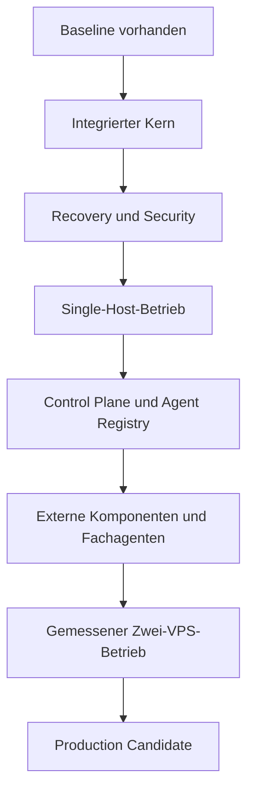

# ScoreSymphony Agent Platform – Roadmap

Status: 2026-09-01  
Repository: `ScoreSymphony/AI-Agent-VPS`  
Ausgangspunkt: Monorepo-Baseline auf `main`, Merge-Commit `a4a1437`

## Zweck

Diese Roadmap beschreibt den Weg von der geprüften Monorepo-Baseline zu einer
betriebsfähigen ScoreSymphony Agent Platform. Sie verwendet bewusst kein
früheres Phasenmodell. Die Reihenfolge ergibt sich aus technischen
Abhängigkeiten, Risiken und überprüfbaren Abnahmekriterien.

## Verbindliches Zielbild

- **Hermes ist der einzige intelligente Orchestrator.**
- **Forge ist die deterministische Execution- und Lifecycle-Engine** für Tasks,
  Runs, Worktrees, Tests, Reviews, Merge-Gates und Audit-Ereignisse.
- **Worker führen begrenzte Aufgaben aus** und bauen keine konkurrierende
  Orchestrierung auf.
- Die **ScoreSymphony-Integrationsschicht** verbindet Hermes und Forge nur über
  versionierte Verträge.
- Die **Control Plane** zeigt Zustand, Ereignisse, Freigaben, Ressourcen und
  Komponenten, besitzt aber keine zweite Orchestrierungslogik.
- Der von ScoreSymphony gepflegte und übernommene Kern bleibt MIT-lizenziert.
  Nicht-MIT-Komponenten werden getrennt installiert und über CLI, MCP, HTTP
  oder andere dokumentierte Prozessgrenzen angebunden.
- Modellgewichte, Geheimnisse, Laufzeitdaten und automatisch installierte
  externe Anwendungen gehören nicht in das Git-Repository.
- Dauerhafte laufende Kosten bleiben auf ChatGPT Plus und die vorhandenen VPS
  begrenzt. Die Roadmap setzt keine zusätzliche kostenpflichtige KI-API voraus.
- KVM 4 und KVM 8 werden erst nach Messungen verbindlich aufgeteilt. Es darf
  dadurch keine zweite Task-Wahrheit und keinen zweiten Orchestrator geben.

## Aktueller Stand

### Erledigt

- Zentrales Monorepo festgelegt und Baseline nach `main` gemergt.
- Forge auf `d49fac7ca6b3b1ce310c3e950aaac64a080f60a6` gepinnt.
- Hermes auf `b81383ec215400cbbc7d9768cf4ce45a19f9092a` gepinnt.
- Nicht-MIT-Unterpfade aus dem übernommenen Hermes-Kern ausgeschlossen und
  dokumentiert.
- Rollen von Hermes, Forge, Workern und Control Plane dokumentiert.
- Version-1-Schemas für Commands und Events angelegt.
- Component Registry mit Qwen Code als deaktivierter
  `managed_external`-Komponente angelegt.
- Baseline-Validierung, Pytest und GitHub Actions eingerichtet und auf `main`
  erfolgreich ausgeführt.
- Read-only-Upstream-Prüfer für Forge und Hermes angelegt.

### Noch nicht umgesetzt

- Laufender Hermes–Forge-Adapter und Transport.
- Gemeinsame Task-/Run-Zuordnung und zuverlässige Event-Übermittlung.
- Shell-Worker-End-to-End-Durchlauf.
- Recovery, Authentifizierung, Autorisierung und Produktionsbetrieb.
- ScoreSymphony Control Plane.
- Agent Registry, unabhängiger Review-Pfad und Modelladapter.
- Installation, Update und Entfernung externer Komponenten.
- Research-, Datei-, Server-, Monitoring- und Deployment-Agenten.
- Verbindliche Rollen von KVM 4 und KVM 8.

## Abhängigkeitskette

Die nachfolgenden Arbeitspakete dürfen parallel bearbeitet werden, wenn ihre
Eingangsvoraussetzungen erfüllt sind. Ein späteres Paket darf ein früheres
Abnahmekriterium nicht umgehen.

## Sofortige Repository-Absicherung

Priorität: **P0**  
Voraussetzung: Baseline auf `main`

### Arbeiten

- `main` durch Pull Requests und den erforderlichen Check `Baseline quality`
  schützen.
- Direktes Pushen und Mergen ohne erfolgreiche CI verhindern.
- Pull-Request-Vorlage mit Ziel, Architekturwirkung, Tests, Lizenzwirkung,
  Sicherheitswirkung und Rollback ergänzen.
- Issue-Vorlagen für Implementierung, Architekturentscheidung, Upstream-Update
  und Sicherheitsproblem ergänzen.
- GitHub-Actions-Abhängigkeiten versionieren und später auf Commit-SHAs pinnen.
- Secret Scanning, Dependency Review und eine zulässige Lizenzliste in CI
  ergänzen, soweit GitHub beziehungsweise freie Werkzeuge dies erlauben.

### Abnahme

- Ein fehlgeschlagener Pflichtcheck verhindert den Merge nach `main`.
- Jede Architektur- oder Upstream-Änderung ist über einen PR nachvollziehbar.
- Keine echten Zugangsdaten befinden sich in Git oder CI-Logs.

## Integrierter Kern

Priorität: **P0**  
Ziel: Der erste vollständige, automatisiert getestete vertikale Durchlauf.

### Contract Runtime

- JSON-Schemas in ausführbare, versionierte Command- und Event-Modelle
  überführen.
- Einheitliche Felder für `command_id`, `task_id`, `run_id`, `correlation_id`,
  Zeitstempel, Schema-Version und Idempotenz festlegen.
- Strukturierte Fehler, Ablehnungen und terminale Ergebnisse definieren.
- Kompatibilitäts- und Negativtests für alle V1-Verträge ergänzen.
- Vor der Implementierung einen ADR für den ersten Transport schreiben.

Für den ersten Slice ist lokales HTTP/JSON auf `localhost` mit einem
ereignisbasierten Rückkanal die bevorzugte Prüfvariante. Ein MCP-Adapter kann
danach dieselben Verträge anbieten; Hermes darf nicht direkt von instabilen
Forge-Interna abhängig werden.

### Forge-Adapter

- V1-Commands auf öffentliche Forge-Funktionen beziehungsweise stabile
  ScoreSymphony-Adapter abbilden.
- Task, Run und Worktree eindeutig zuordnen.
- Lifecycle-Übergänge, Leases, CI, Review und Merge-Gates in Forge belassen.
- Ungültige, doppelte oder zu spät eintreffende Commands deterministisch
  ablehnen.
- Forge-Ergebnisse in V1-Events übersetzen.

### Hermes-Adapter

- ScoreSymphony-Tools für `create_task`, `start_worker`, `run_tests`,
  `request_review`, `merge_task`, `cancel_run` und Statusabfragen bereitstellen.
- Hermes-Pläne in gültige Commands übersetzen.
- Events und Endergebnisse wieder in Hermes-Kontext übernehmen.
- Sicherstellen, dass Hermes plant, Forge aber Zustände und Gates durchsetzt.
- Keine zweite Scheduler-, Task-State- oder Review-Instanz neben Forge bauen.

### Deterministischer Shell-Worker

- Ausschließlich ein Test-Repository beziehungsweise Fixture bearbeiten.
- Von Forge einen isolierten Worktree und eine begrenzte Anweisung erhalten.
- Eine vorhersehbare Dateiänderung ausführen.
- Tests starten, Belege zurückgeben und keine unzulässigen Pfade verändern.
- Erfolgs-, Testfehler-, Abbruch-, Timeout- und Wiederholungsfall abdecken.

### End-to-End-Abnahme

Der integrierte Kern gilt erst als fertig, wenn CI automatisch beweist:

1. Hermes erzeugt einen gültigen Task-Command.
2. Forge erstellt Task, Run und isolierten Worktree.
3. Der Shell-Worker verändert nur die erlaubte Fixture.
4. Forge speichert Test- und Review-Ergebnisse.
5. Ein fehlgeschlagenes Gate verhindert den Merge.
6. Ein erfolgreicher Lauf darf kontrolliert gemergt werden.
7. Hermes erhält das terminale Ergebnis als versioniertes Event.
8. Derselbe Command erzeugt bei Wiederholung keinen zweiten unkontrollierten
   Run.

## Zuverlässigkeit und Recovery

Priorität: **P0 nach dem vertikalen Slice**

### Arbeiten

- Kanonische Zuständigkeiten für Task-, Run-, Worktree-, Review- und
  Orchestrierungszustand im Code erzwingen.
- Persistente Zuordnung zwischen Hermes-Plan und Forge-Task einführen.
- Event-Reihenfolge, Idempotenz, Replay und Dead-Letter-Verhalten definieren.
- Abgelaufene Leases, abgestürzte Worker und verwaiste Worktrees erkennen.
- Kontrollierte Wiederaufnahme nach Prozess- oder VPS-Neustart implementieren.
- Retry-Budgets und begrenzte Review-/Nachbesserungsschleifen festlegen.
- Backup- und Restore-Test für den minimalen Plattformzustand ergänzen.

### Abnahme

- Ein Neustart verliert keinen bestätigten Task und startet ihn nicht doppelt.
- Verwaiste Worktrees und Runs werden erkannt und sicher behandelt.
- Replay erzeugt denselben nachvollziehbaren Zustand oder schlägt geschlossen
  und sichtbar fehl.
- Alle Zustandsänderungen besitzen eine prüfbare Ereignisspur.

## Security-, Policy- und Freigabeschicht

Priorität: **P0 vor externer Erreichbarkeit**

### Arbeiten

- Dienste zunächst nur an Loopback beziehungsweise ein privates Netz binden.
- Dienstidentitäten und kurzlebige interne Tokens einführen.
- Rollen für Operator, Orchestrator, Worker, Reviewer und Read-only-Beobachter
  definieren.
- Tool-, Pfad-, Command-, Netzwerk- und Ressourcen-Policies zentral erzwingen.
- Sichere Workspace-Wurzeln, Command-Allowlist und Egress-Regeln einführen.
- Secrets nur über VPS-/Container-Secrets bereitstellen und aus Events,
  Terminalausgaben und Logs redigieren.
- Menschliche Freigaben für Merge, Deployment, destruktive Aktionen,
  Komponenteninstallation und sensible Serveraktionen vorsehen.
- Normale Agenten erhalten keinen unbeschränkten Docker-Socket, Root-/Sudo-,
  SSH-, Firewall-, Hostinger-Control- oder Produktions-Secret-Zugriff.

### Abnahme

- Nicht autorisierte Commands und Pfadzugriffe werden getestet abgewiesen.
- Kein Worker kann Lifecycle-Gates oder Freigaben umgehen.
- Die Plattform kann sicher betrieben werden, ohne Dienste ungeschützt ins
  Internet zu stellen.

## Reproduzierbarer Single-Host-Betrieb

Priorität: **P1**  
Voraussetzungen: integrierter Kern, Recovery-Grundlage und lokale Security.

### Arbeiten

- Reproduzierbares Compose-/Deployment-Profil für einen VPS erstellen.
- Health-, Readiness- und Dependency-Checks ergänzen.
- Persistente Volumes, Verzeichnisrechte, Ressourcenlimits und Log-Rotation
  festlegen.
- Migrationen, Bootstrap, Upgrade und Rollback skriptbar machen.
- Reverse Proxy und TLS erst nach Authentifizierung und interner Absicherung
  hinzufügen.
- Backup und Restore auf einer frischen Instanz testen.
- Betriebsanleitung für Start, Stop, Update, Fehlerdiagnose und Recovery
  schreiben.

### Abnahme

- Eine frische unterstützte VPS-Installation startet reproduzierbar.
- Der komplette Shell-Worker-Slice läuft dort ohne manuelle Codeänderung.
- Neustart, Backup/Restore und Rollback sind dokumentiert und getestet.
- CPU-, RAM-, Speicher-, I/O- und Queue-Metriken werden erfasst.

## ScoreSymphony Control Plane

Priorität: **P1 nach stabilem Single-Host-Slice**

### Minimaler Umfang

- Übersicht über Plattformzustand und aktuelle Blocker.
- Tasks, Runs, Worktrees und deren Lifecycle.
- Ereignis- und Audit-Timeline.
- Tests, Reviews, Freigaben und Merge-Gates.
- Agenten-, Modell- und Tool-Registry.
- Ressourcen- und Queue-Ansicht.
- Komponentenstatus, verfügbare Updates und Health Checks.
- Einstellungen mit klarer Trennung zwischen Entwicklungs- und VPS-Admin-
  Funktionen.

### Danach

- Multi-Agent-Terminal mit `xterm.js` und strikten Sitzungsrechten.
- Workflow-/Task-Graph mit React Flow beziehungsweise xyflow.
- Research-, Datei-, Infrastruktur- und Modellansichten.
- Benachrichtigungen, Filter, gespeicherte Ansichten und operatorfreundliche
  Fehlerdiagnose.

### Abnahme

- Die UI zeigt ausschließlich kanonischen Runtime-Zustand und erfindet keinen
  zweiten Task-State.
- Riskante Aktionen erfordern sichtbare Freigaben.
- Jeder UI-Befehl ist autorisiert, auditierbar und über dieselben Verträge wie
  andere Clients ausgeführt.

## Agent Registry, Worker und Review

Priorität: **P1**

### Arbeiten

- Einheitliches Agentenmanifest für Fähigkeiten, Tools, Modell, Ressourcen,
  Sicherheitsprofil und Health Check definieren.
- Task Router und Resource Scheduler als getrennte Verantwortungen hinter
  Hermes und Forge halten: Hermes wählt die fachliche Ausführungsart, die
  Runtime entscheidet deterministisch über Zulassung und Kapazität.
- Shell-Worker als Referenzimplementierung beibehalten.
- Coding-, Research-, Datei-, Server- und Review-Worker schrittweise ergänzen.
- Einen unabhängigen, standardmäßig read-only Review-Pfad mit begrenzten
  Nachbesserungsschleifen einführen.
- Codex/FCC nur über einen dokumentierten Adapter und ohne zusätzliche
  kostenpflichtige API-Annahme integrieren.
- Qwen beziehungsweise lokale Modelle als messbare Worker-Optionen behandeln,
  nicht als zweite Orchestrierung.

### Abnahme

- Jeder Worker besitzt ein minimales Berechtigungsprofil.
- Ressourcenlimits und Parallelitätsgrenzen werden vor dem Start geprüft.
- Reviewer können Belege prüfen, aber nicht unkontrolliert selbst mergen oder
  Serverrechte erweitern.
- Modell- oder Agentenwechsel verändert die Plattformverträge nicht.

## Component Manager

Priorität: **P1 nach Agent Registry und Security**

### Arbeiten

- Registry-Schema für `core`, `vendored`, `managed_external` und
  `remote_external` vervollständigen.
- Installation, Version-Pin, Prüfsumme, Lizenzanzeige, Health Check, Update,
  Rollback und Entfernung implementieren.
- Downloads ausschließlich aus deklarierten Originalquellen erlauben.
- Quellcode externer Nicht-MIT-Komponenten nicht in den MIT-Kern übernehmen.
- Installation und Update nur nach Operator-Freigabe ausführen.
- Qwen Code als erste kontrollierte `managed_external`-Pilotkomponente nutzen.
- Danach weitere Komponenten einzeln nach Nutzen, Lizenz, Ressourcenbedarf und
  Integrationsgrenze prüfen.

### Spätere Kandidaten

- Coding und Modelle: Qwen Code und lokal laufende OpenAI-kompatible Endpunkte.
- Dateien und Entwicklung: Copyparty, code-server.
- Container und Betrieb: Dockge, Beszel, Dozzle, Uptime Kuma.
- Musikwissenschaft und Research: XMG, CRIM-Intervalle und weitere geprüfte
  Werkzeuge aus der externen Research-Masterliste.

### Abnahme

- Ein externer Pilot kann installiert, geprüft, aktualisiert, zurückgerollt und
  restlos aus der Plattformregistrierung entfernt werden.
- Herkunft, Version, Lizenz und Integrationsgrenze sind jederzeit sichtbar.
- Ein fehlgeschlagener Installer beschädigt den Core nicht.

## Research-, Datei- und Fachagenten

Priorität: **P2 nach stabiler Runtime und Component Manager**

### Research

- Schlanken Search Broker statt eines in den MIT-Kern kopierten SearXNG-Forks
  entwickeln.
- Provider zunächst für GitHub, arXiv, Crossref, OpenAlex, Semantic Scholar,
  IMSLP und MusicBrainz anbinden.
- Quellenprovenienz, Abrufdatum, Zitate, Duplikaterkennung und reproduzierbare
  Research-Runs speichern.
- Research-Ergebnisse über Reviews und menschliche Freigaben in
  ScoreSymphony-Wissensbestände überführen.

### Dateien

- Sichere Workspace-Wurzeln, Dateiversionen, Vorschau, Diff und Freigabe
  bereitstellen.
- Upload, Download und Export von der Agentenbearbeitung trennen.
- Große und binäre Dateien außerhalb von Git verwalten.
- Optionalen Datei-Dienst nur als getrennte Komponente anbinden.

### Fachagenten

- Musikanalyse-, Quellen-, Metadaten- und Korpus-Worker über klar begrenzte
  Aufträge integrieren.
- Die eigentliche ScoreSymphony-Musikanwendung bleibt ein getrenntes fachliches
  System und kommuniziert über versionierte APIs oder Jobs mit der Agent
  Platform.
- Agenten unterstützen Analyse, Vergleich, Recherche und Erklärung; sie
  überschreiben keine geprüften Fachdaten ohne Provenienz und Freigabe.

## Observability und Betrieb

Priorität: **P1/P2, beginnend mit dem Single-Host-Betrieb**

### Arbeiten

- Strukturierte Logs, Metriken, Traces und Audit-Events mit gemeinsamen IDs
  verbinden.
- Laufzeit, Fehlerquote, Retry-Zahl, Queue-Wartezeit, CPU, RAM, I/O,
  Speicherbedarf und Modellnutzung erfassen.
- Warnungen für ausgefallene Dienste, blockierte Queues, verwaiste Leases,
  fehlgeschlagene Backups und ungewöhnliche Ressourcenlast einführen.
- Beszel, Dozzle und Uptime Kuma nur dann anbinden, wenn sie gegenüber der
  eigenen Telemetrie einen klaren Betriebsnutzen liefern.
- Runbooks für typische Fehlerbilder und Eskalationen schreiben.

### Abnahme

- Ein fehlerhafter Run ist über Task-, Run- und Correlation-ID vollständig
  nachvollziehbar.
- Alerts zeigen eine konkrete Handlung und vermeiden unnötiges Dauerrauschen.
- Backup- und Restore-Erfolg wird überwacht.

## KVM 4 und KVM 8

Priorität: **P2 nach gemessenem Single-Host-Betrieb**

### Entscheidungsverfahren

- Den stabilen vertikalen Slice und repräsentative Worker-Last zunächst auf
  einem VPS benchmarken.
- CPU, RAM, Speicher, I/O, Netzwerk, Queue-Latenz und Ausfallauswirkungen
  vergleichen.
- Erst danach Rollen von KVM 4 und KVM 8 festlegen.

### Zu prüfende Zielaufteilung

- Leistungsstärkerer Runtime-/Worker-Host für Hermes, Forge und aktive Worker.
- Getrennter Betriebs-, Staging-, Monitoring-, Backup- oder Benchmark-Host.
- Private, authentifizierte Verbindung zwischen beiden VPS.
- Nur eine kanonische Task-/Run-Wahrheit; Infrastruktur darf Lifecycle,
  Routing, Review oder Shared State nicht duplizieren.
- Rechenintensive lokale Modelle und GPU-Tests bleiben Pilot- beziehungsweise
  Benchmark-Pfade, bis ihr Nutzen gemessen ist.

### Abnahme

- Die Aufteilung besitzt einen messbaren Vorteil gegenüber einem Host.
- Der Ausfall eines Hosts führt zu einem definierten, getesteten Verhalten.
- Backup, Restore, Netzwerkgrenzen und minimale Berechtigungen sind geprüft.

## Upstream- und Lizenzpflege

Priorität: **laufend**

### Dienstags und freitags

- Forge- und Hermes-Upstream auf neue Commits, Releases und Security-Fixes
  prüfen.
- Änderungen als relevant, irrelevant, konfliktbehaftet oder sicherheitskritisch
  klassifizieren.
- Lizenzänderungen und neu hinzugekommene Unterlizenzen erneut scannen.
- Niemals automatisch nach `main` mergen.

### Übernahmeprozess

1. Dedizierten Upstream-Update-Branch erstellen.
2. Neuen Commit-Pin und Provenienz aktualisieren.
3. Ausschlüsse und Lizenzgrenze erneut prüfen.
4. Baseline-, Contract-, Integrations- und später End-to-End-Tests ausführen.
5. ScoreSymphony-Anpassungen und Migrationsrisiken dokumentieren.
6. Erst nach Review und grüner CI mergen.

## Release-Gates

Diese Gates sind Zustände, keine nummerierten Projektphasen.

| Gate | Erforderlicher Nachweis |
|---|---|
| **Baseline** | Gepinnte, lizenzgeprüfte Quellen und grüne Baseline-CI. Erreicht. |
| **Integrated Kernel** | Vollständiger Hermes–Forge–Shell-Worker-Slice mit negativen Gates. |
| **Recoverable Runtime** | Neustart, Replay, Lease-Recovery und Audit ohne Doppelstarts. |
| **Operable Single Host** | Reproduzierbares Deployment, Auth, Backup/Restore und Metriken. |
| **Controlled Multi-Agent** | Agent Registry, Ressourcenlimits, unabhängiger Review und Freigaben. |
| **Extensible Platform** | Control Plane und sicherer Component Manager mit Pilotkomponente. |
| **Research Ready** | Reproduzierbarer Search Broker, Quellenprovenienz und Fachworker. |
| **Two-VPS Operational** | Gemessene Rollen, sichere Verbindung und getestetes Ausfallverhalten. |
| **Production Candidate** | Sicherheits-, Recovery-, Lizenz-, Last- und Betriebsabnahme bestanden. |

## Priorisiertes GitHub-Backlog

| Reihenfolge | Arbeitspaket | Priorität | Abhängigkeit |
|---:|---|---|---|
| 1 | `main` schützen und PR-/Issue-Vorlagen ergänzen | P0 | Baseline |
| 2 | ADR für Transport und Prozessgrenzen erstellen | P0 | Baseline |
| 3 | V1 Contract Runtime mit Validierung und Fehlern bauen | P0 | ADR |
| 4 | Forge-Adapter für den minimalen Lifecycle bauen | P0 | Contract Runtime |
| 5 | Hermes-Tool-/Event-Adapter bauen | P0 | Contract Runtime |
| 6 | Deterministischen Shell-Worker implementieren | P0 | Forge-Adapter |
| 7 | End-to-End-Erfolgs- und Fehlerpfade in CI beweisen | P0 | Adapter + Worker |
| 8 | Idempotenz, Persistenz, Replay und Recovery härten | P0 | E2E-Slice |
| 9 | Auth-, Policy-, Secret- und Approval-Schicht ergänzen | P0 | E2E-Slice |
| 10 | Single-Host-Deployment und Restore-Test erstellen | P1 | Recovery + Security |
| 11 | Observability-Grundlage und Runbooks ergänzen | P1 | Single Host |
| 12 | Minimale Control Plane für Tasks/Runs/Events bauen | P1 | stabile Runtime |
| 13 | Agent Registry und Ressourcensteuerung bauen | P1 | stabile Runtime |
| 14 | Unabhängigen Review-Pfad integrieren | P1 | Agent Registry |
| 15 | Component Manager mit sicherem Pilot bauen | P1 | Security + Registry |
| 16 | Qwen Code als externe Pilotkomponente prüfen | P1 | Component Manager |
| 17 | Research Broker und Quellenprovenienz bauen | P2 | stabile Plattform |
| 18 | Datei- und Workspace-Funktionen bauen | P2 | Security + Control Plane |
| 19 | KVM-4-/KVM-8-Benchmarks und Rollenentscheidung treffen | P2 | Single Host + Metriken |
| 20 | Zwei-VPS-Deployment und Ausfalltests umsetzen | P2 | Rollenentscheidung |
| 21 | ScoreSymphony-Fachanbindung und Musikanalyse-Worker integrieren | P2 | Research Ready |

## Definition of Done für jedes Arbeitspaket

- Implementierung und Dokumentation stimmen überein.
- Architektur-, Lizenz- und Sicherheitsgrenzen bleiben eingehalten.
- Unit-, Integrations- und erforderliche Negativtests sind grün.
- Ereignisse und Fehler sind beobachtbar und enthalten keine Geheimnisse.
- Migration und Rollback sind beschrieben, wenn persistenter Zustand betroffen
  ist.
- `CURRENT_STATE.md` wird sachlich aktualisiert.
- Der PR enthält Abnahmekriterien und Belege; `main` bleibt jederzeit
  reproduzierbar.

## Bewusst noch nicht vorziehen

Vor dem Gate **Integrated Kernel** werden nicht als blockierende Arbeiten
begonnen:

- vollständige Dashboard-Neugestaltung,
- Qwen-Code-Installation oder lokale Großmodelle,
- mehrere produktive Agententypen,
- Research- und Musikanalyse-Pipelines,
- Monitoring-Suite aus mehreren externen Anwendungen,
- endgültige KVM-4-/KVM-8-Aufteilung,
- GPU-Worker oder öffentliche Produktionsfreigabe.

## Unmittelbar nächste Pull Requests

1. **Repository Governance:** Branch-Schutz vorbereiten, PR-/Issue-Vorlagen und
   strengere CI-Prüfungen ergänzen.
2. **Integration Contract Runtime:** Transport-ADR, ausführbare V1-Modelle,
   Validierung, Idempotenz- und Fehlergrundlage.
3. **Hermes–Forge Vertical Slice:** beide Adapter, Shell-Worker und vollständige
   End-to-End-Erfolgs- und Fehlerpfade.

Erst nach dem dritten Pull Request ist die Baseline eine tatsächlich integrierte
Agentenplattform. Bis dahin müssen README, UI und Betriebsdokumentation klar
zwischen vorhandener Struktur und funktionierender Integration unterscheiden.
